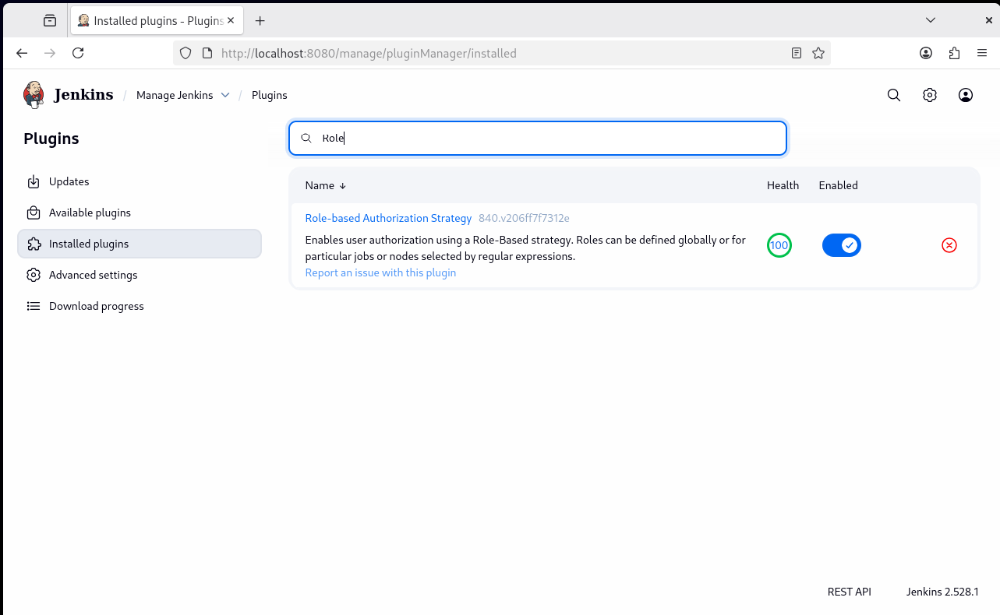
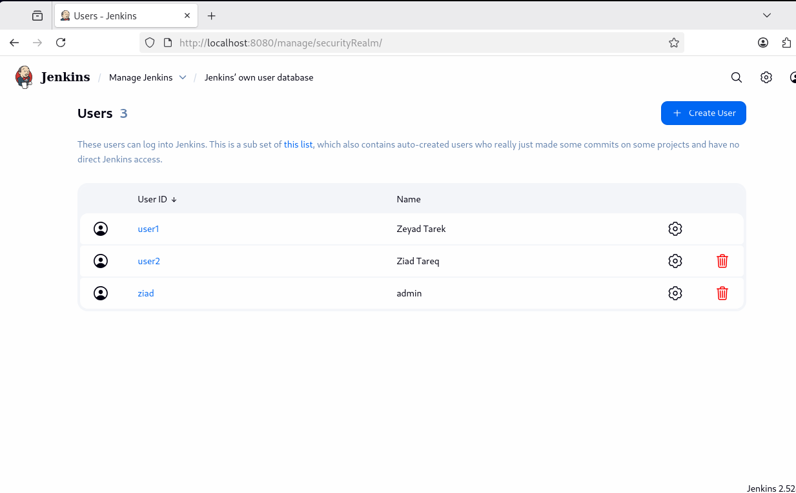
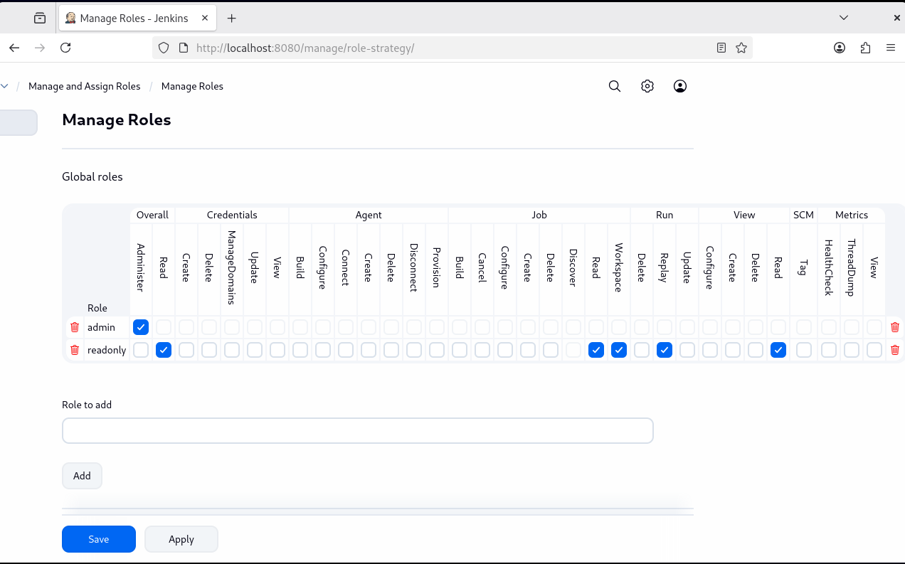
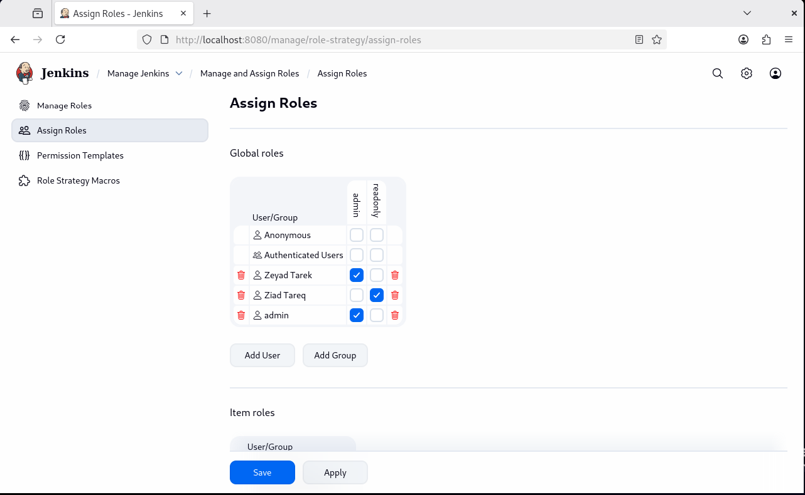

# Lab 29: Role-based Authorization in Jenkins

## Overview

This lab demonstrates the implementation of Role-Based Access Control (RBAC) in Jenkins using the web interface. Two users with different permission levels will be created: an admin user (user1) with full access and a read-only user (user2) with limited viewing permissions.

### Step 1: Access Jenkins Web Interface

1. Open your web browser
2. Navigate to: `http://192.168.52.133:8080`
3. Log in with your admin credentials

### Step 2: Install Role-Based Authorization Strategy Plugin

#### Method 1: Via Plugin Manager

1. Click **Manage Jenkins** from the left sidebar
2. Click **Manage Plugins** (or **Plugins** in newer versions)
3. Click the **Available plugins** tab
4. Search for "Role-based Authorization Strategy"
5. Check the box next to the plugin
6. Click **Install without restart** or **Download now and install after restart**
7. Wait for installation to complete

#### Verify Plugin Installation

1. Go to **Manage Jenkins** → **Manage Plugins**
2. Click **Installed plugins** tab
3. Search for "Role-based" to confirm installation

### Step 3: Enable Role-Based Authorization Strategy

1. Go to **Manage Jenkins**
2. Click **Security**
3. In the **Authorization** section:
   - Select **Role-Based Strategy**
4. Click **Save** at the bottom of the page

### Step 4: Create Users via Web Interface

#### Create user1 (Admin User)

1. Go to **Manage Jenkins**
2. Click **Users** 
3. Click **Create User** 
4. Fill in the form:
5. Click **Create User**

#### Create user2 (Read-only User)

1. From the same **Manage Users** page
2. Click **Create User** again
3. Fill in the form:
4. Click **Create User**

#### Verify Users Created

You should now see both users in the user list:
- user1
- user2
- admin (original admin user)

### Step 5: Configure Role-Based Authorization

#### Access Manage and Assign Roles

1. Go to **Manage Jenkins**
2. Click **Manage and Assign Roles**
3. You'll see two options:
   - **Manage Roles** - Create and configure roles
   - **Assign Roles** - Assign roles to users

### Step 6: Create and Configure Roles

1. In the **Role to add** field under Global roles, type: `readonly`
2. Click **Add**
3. Configure permissions for the readonly role by checking these boxes:

   **Overall:**
   - Read

   **Job:**
   - Read
   - Discover

   **View:**
   - Read

   **Run:**
   - Replay (optional)

4. Leave all other permissions unchecked
5. Scroll down and click **Save**

### Step 7: Assign Roles to Users

1. Go to **Manage Jenkins** → **Manage and Assign Roles**
2. Click **Assign Roles**
3. In the **Global roles** section:
   - Find the **User/group to add** field
   - Type: `user1`
   - Click **Add**
4. In the table, find user1 and check the **admin** box
5. Click **Save**

6. From the same **Assign Roles** page
7. In the **Global roles** section:
   - In the **User/group to add** field
   - Type: `user2`
   - Click **Add**
8. In the table, find user2 and check the **readonly** box
9. Click **Save**

### Step 8: Test User Permissions

#### Test user1 (Admin) Access

1. **Log out** from Jenkins (click username → SIGN out)
2. Log in as **user1** 
3. Verify admin capabilities:
   - Can access **Manage Jenkins**
   - Can create new jobs/items
   - Can configure jobs
   - Can build jobs
   - Can delete jobs
   - Can manage plugins
   - Can manage users
   - Full access to all features

#### Test Creating a Job as user1

1. Click **New Item**
2. Enter name: `test-job`
3. Select **Freestyle project**
4. Click **OK**
5. Configure the job (add any build step)
6. Click **Save**
7. Click **Build Now**
8. Verify build runs successfully

#### Test user2 (Read-Only) Access

1. **Sign out** from Jenkins
2. Log in as **user2** with the password you created
3. Verify read-only capabilities:
   - Can view dashboard
   - Can view jobs
   - Can view build history
   - Can view build logs
   - Can view workspace
   - **Cannot** access Manage Jenkins
   - **Cannot** create new jobs
   - **Cannot** configure jobs
   - **Cannot** delete jobs
   - **Cannot** trigger builds (unless explicitly allowed)
